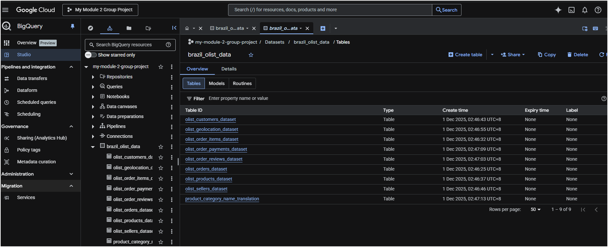

# Approach to Handle Module 2 Group Project

## Updated as of  1 Dec 2025

## Ideation: 
### Plan A:
1. Use meltano to ingest/extract data from csv files to load to Google BigQuery
2. Use dbt to transform data to be loaded to Google BigQuery

### Plan B:
1. Use Google BigQuery to ingest/extract data from cvs files
2. Use dbt to transform data to be loaded to Google BigQuery

### Plan C:
1. Load data source: cvs files to DuckDB
2. Extract load from DuckDB using Meltano to Google BigQuery
3. Use dbt to transform data in Google BigQuery

## *Plan That Works*
1. Used Kaggle API to extract csv files 
Using Python:
2. Extracted csv files as DataFrames iteratively
3. Loaded DataFrames to Google BigQuery

## Please refer to [extractfromkaggle notebook](notebook/extractfromkaggle.ipynb) for more information.

## Schema 
 

## Useful References
### 1. Details of Brazil Olist → https://www.kaggle.com/datasets/olistbr/brazilian-ecommerce
### 2. Meltano tap-csv extractor → https://hub.meltano.com/extractors/tap-csv/
### 3. Thomas' Meltano cheatsheet → https://github.com/mlnotes2718/Data-Eng-Notes/blob/a200aa5d94794f8668e0e037a6f62435df3797e2/Meltano%20Cheatsheet.md
### 4. Kaggle API → https://github.com/Kaggle/kaggle-api

## Sample Implementations

