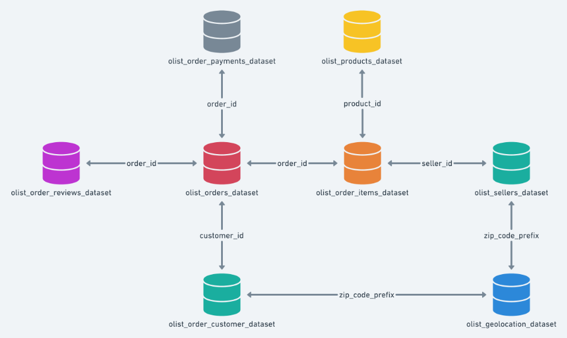
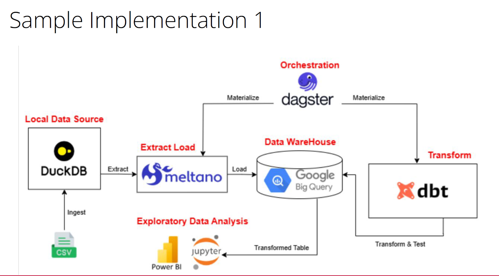
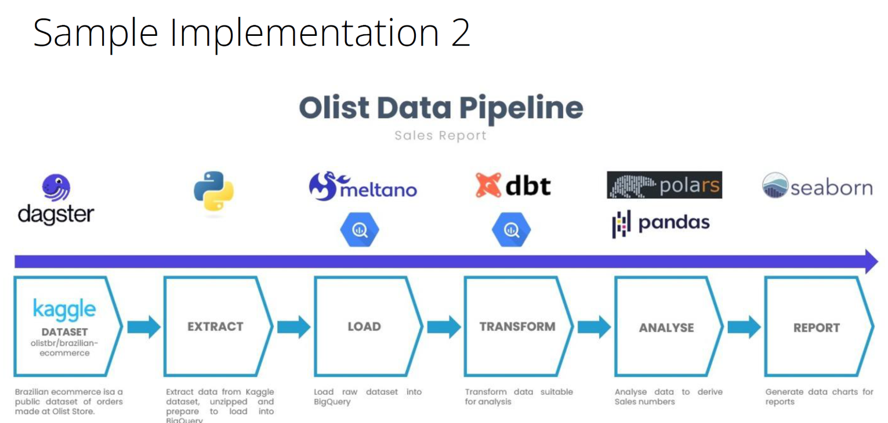

# Approach to Handle Module 2 Group Project

Updated as of Fri 28 Nov 2025

## Plan A:

# 1. Use meltano to ingest/extract data from csv files to load to Google BigQuery
# 2. Use dbt to transform data to be loaded to Google BigQuery

## Plan B:
# 1. Use Google BigQuery to ingest/extract data from cvs files
# 2. Use dbt to transform data to be loaded to Google BigQuery

 
 ## Schema 
 

## Useful References
# 1. Details of Brazil Olist → https://www.kaggle.com/datasets/olistbr/brazilian-ecommerce
# 2. Meltano tap-csv extractor → https://hub.meltano.com/extractors/tap-csv/
# 3. Thomas' Meltano cheatsheet → https://github.com/mlnotes2718/Data-Eng-Notes/blob/a200aa5d94794f8668e0e037a6f62435df3797e2/Meltano%20Cheatsheet.md

## Sample Implementations

